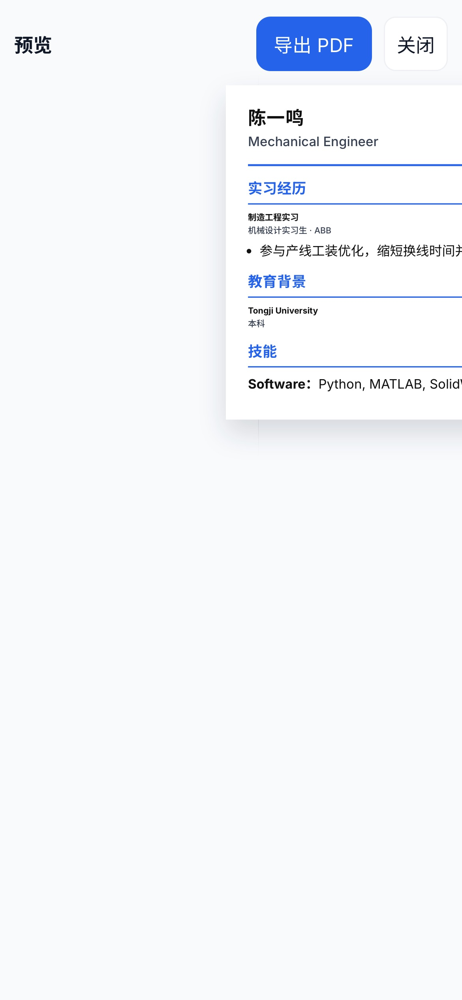
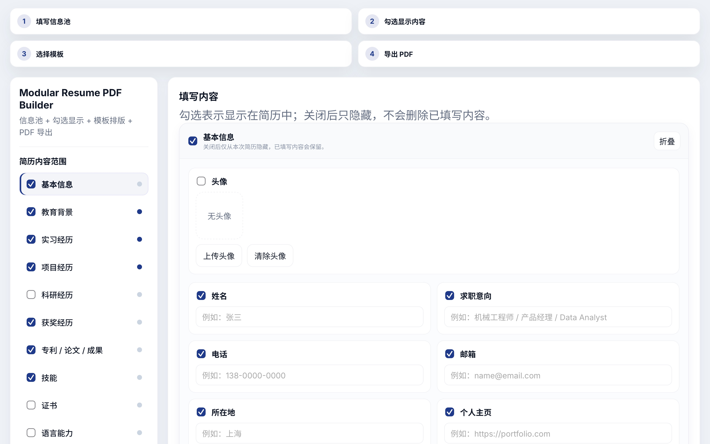
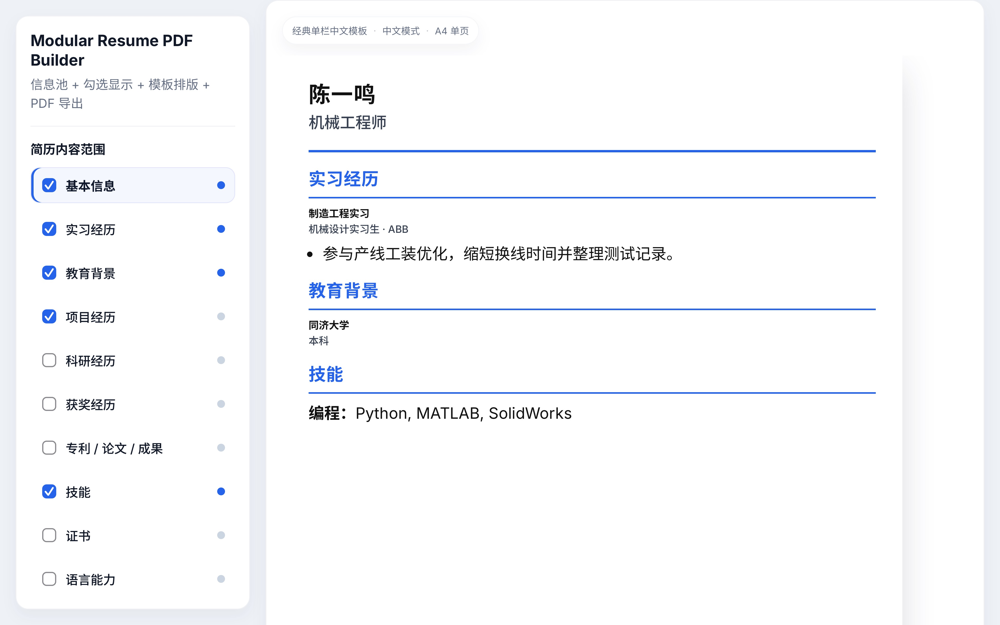

# Modular Resume PDF Builder

[中文说明](README_ZH.md)

One information pool. Multiple tailored resumes.

[Live Demo](https://dreaminmaster.github.io/modular-resume-pdf-builder/) · [GitHub](https://github.com/Dreaminmaster/modular-resume-pdf-builder) · Version: unreleased pre-v1.1.0 · License: MIT

---

## Why this project exists

Most resume tools start from a fixed template.

This project starts from your content.

You keep a complete resume information pool, choose what should appear for one specific application, switch layouts, and export a tailored PDF.

It is designed for people who need multiple resume versions without rewriting the same material again and again.

---

## Workflow

### 1. Fill your information pool
Write down your education, internships, projects, awards, skills, links, and other materials once.

### 2. Choose what to show
Show or hide modules, fields, entries, and description points for the current role.

Hidden content is preserved. It is not deleted.

### 3. Export a tailored resume
Choose a layout, preview the result in real time, and export a clean PDF.

---

## Features

- **Information pool** — keep all resume content in one place
- **Show or hide content** — tailor one version without losing other content
- **Multiple templates** — switch layouts without rewriting the resume
- **Preset themes** — apply professional color schemes
- **Live preview** — see the A4 result while editing
- **PDF export** — export only the resume page
- **Mobile support** — edit, preview, and export on phone
- **Data stays in your browser** — no account and no backend required

---

## Use cases

### Engineering student
Highlight projects, technical skills, internships, and engineering results.

### Product manager
Emphasize selected projects, outcomes, portfolio links, and role fit.

### Study abroad application
Organize education, research, achievements, and language-related content in one place.

### English resume
Prepare a cleaner English-first version without rebuilding everything from scratch.

---

## Screenshots

### Editor

### Mobile editor

### Theme presets in action

### Theme & Layout settings

### PDF preview

---

## Privacy

- no backend
- no account
- data stays in your browser unless you export it

---

## Changelog

### Current status
- project is ready for release polishing
- v1.1.0 is prepared but not tagged yet

### Recent updates
- added 3 new resume templates (compact Chinese, English ATS, engineering project focus)
- added 6 professional theme presets (Graphite, Navy, Slate, Indigo, Forest, Burgundy)
- polished existing 6 resume templates (classic Chinese, minimal English, engineering, campus, product, academic)
- improved mobile editing / preview / export flow
- polished sidebar and A4 preview experience
- added customizable PDF filename
- updated README toward a product-style homepage

---

## Roadmap

- more templates
- better screenshot assets for README
- stronger demo and onboarding experience
- optional AI tailoring later

---

## License

MIT
